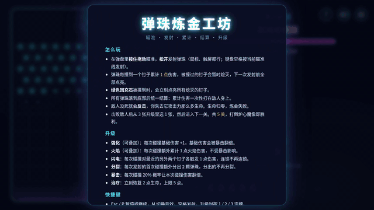
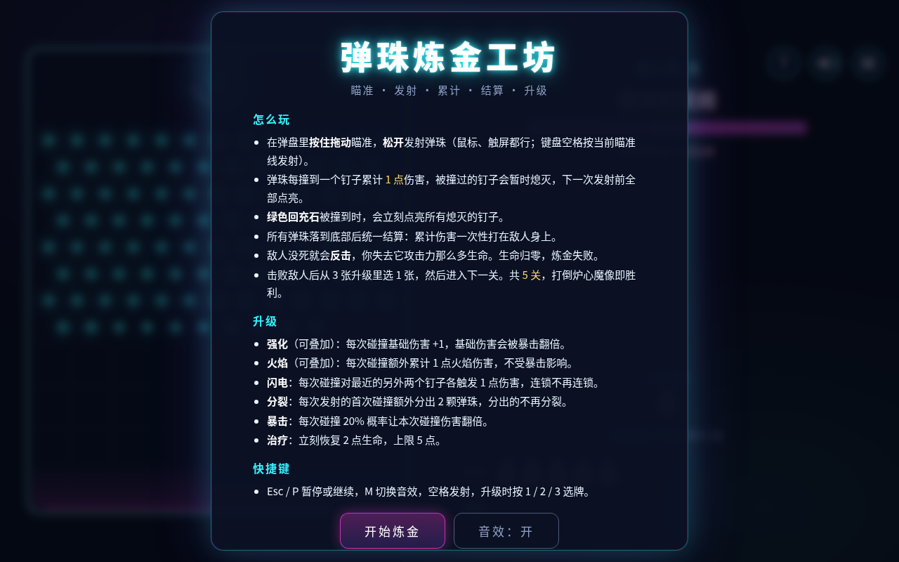
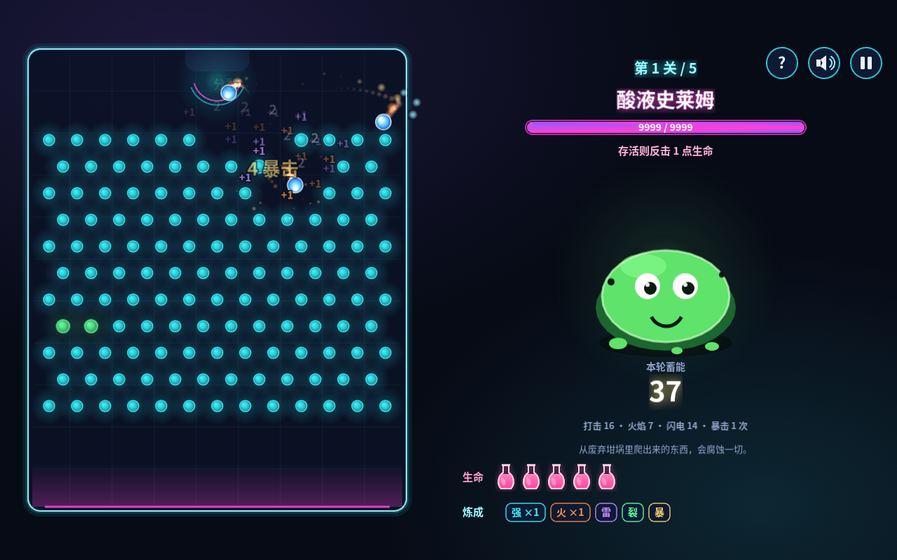
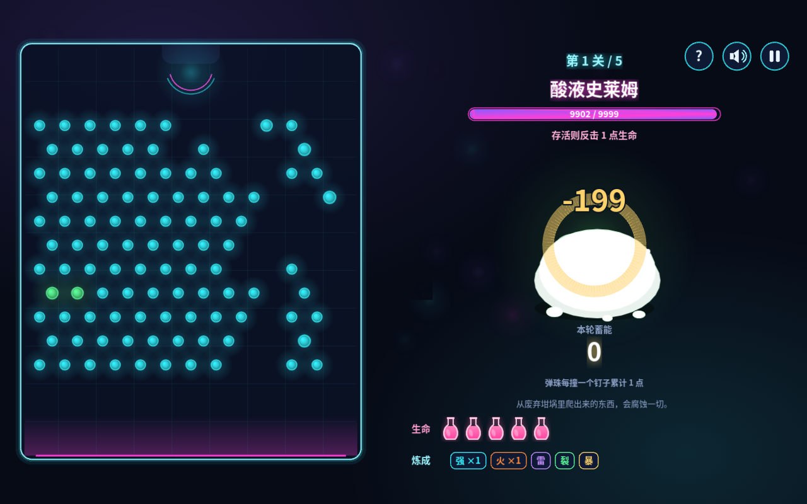
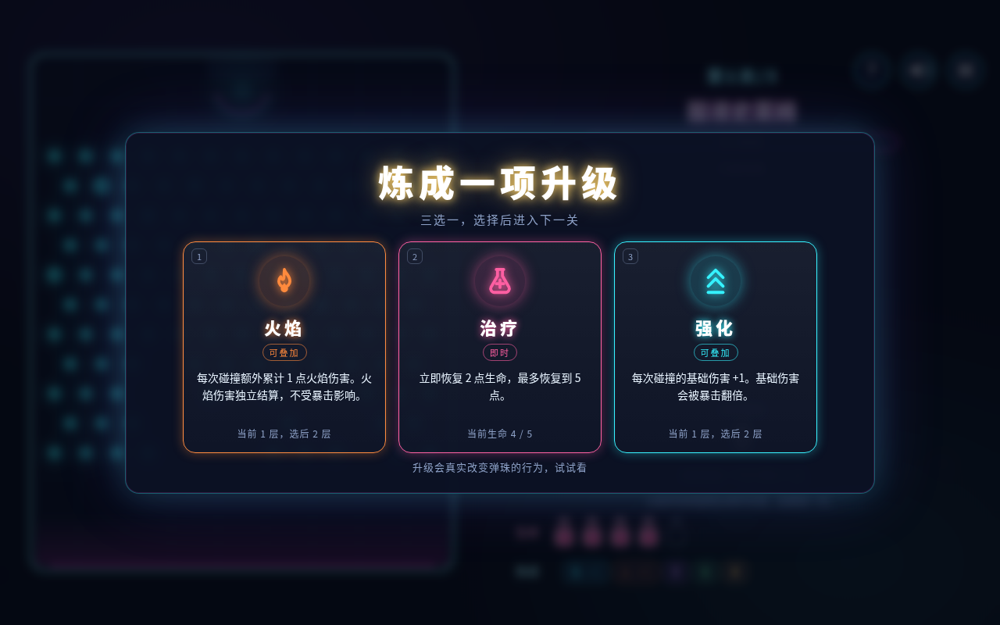
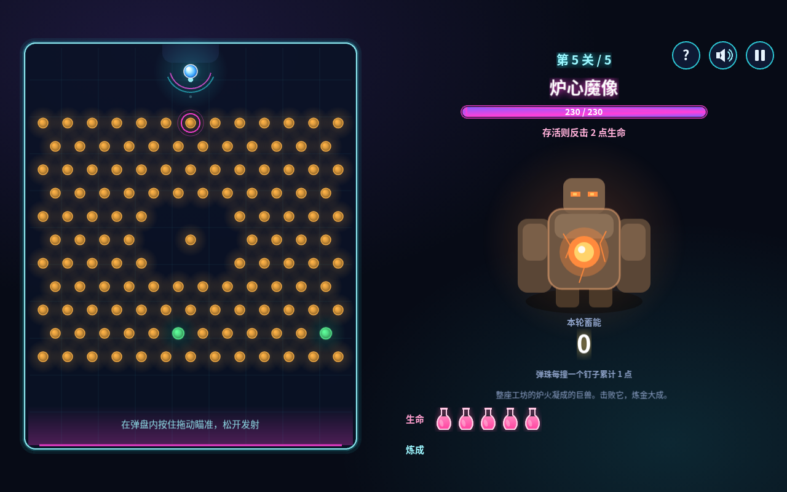
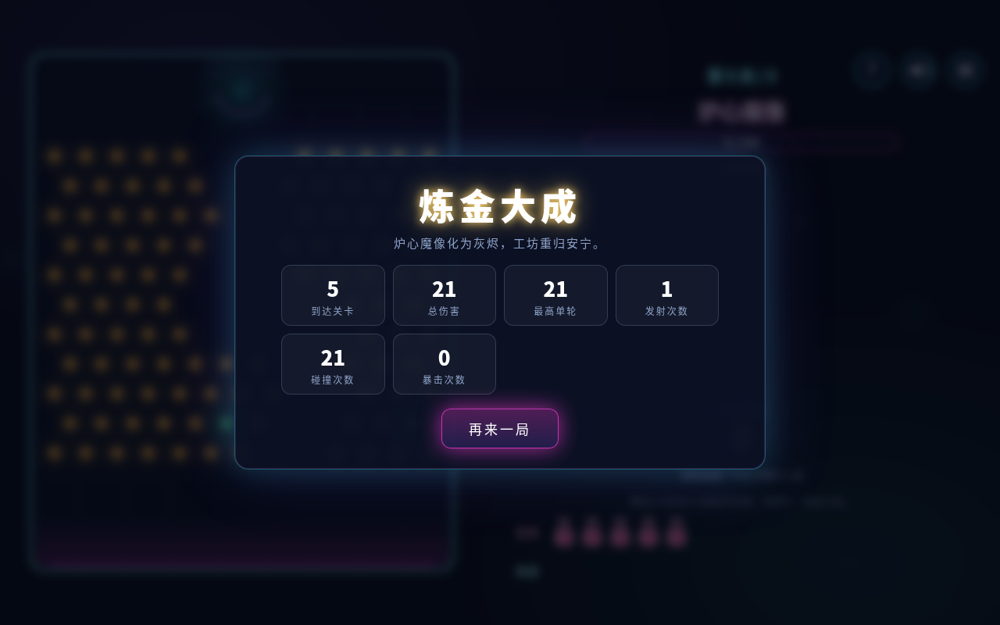

# 弹珠炼金工坊 / Marble Alchemy Workshop

霓虹炼金工坊风格的弹珠 Roguelite 浏览器小游戏：瞄准发射弹珠，撞钉子累计伤害，所有弹珠落底后一次结算，
击败五关敌人即炼金大成。TypeScript + Phaser 3.90（Matter 物理）+ Vite。无后端、无在线接口、无外部图片与音频，
全部美术用 Canvas / Graphics 程序绘制，音效用 WebAudio 合成。

在线试玩：https://convee.cn/marble-alchemy-claude/ （GitHub Pages，仓库 https://github.com/convee/marble-alchemy-claude ）



完整演示视频：[docs/media/gameplay.mp4](docs/media/gameplay.mp4)（录制方式见下文「录屏」）。
测试与测评结论：[docs/TEST-REPORT.md](docs/TEST-REPORT.md)。

## 本地运行

要求 Node 20.19 以上或 22.12 以上（Vite 7 的要求）。

```bash
npm ci            # 按 package-lock.json 安装
npm run dev       # 开发服务器 http://localhost:5173（绑定 0.0.0.0，可局域网访问）
```

## 构建与预览

```bash
npm run build     # 先 tsc 类型检查，再 vite build 输出到 dist/
npm run preview   # 静态预览 dist/，默认 http://localhost:4173
```

`dist/` 是纯静态文件（`base: './'`），可放到任意静态托管目录或子路径。

## 测试

```bash
npm test          # Vitest 单元测试：升级池规则、伤害与回合计算、五关弹盘布局、卡住看门狗
npm run test:e2e  # Playwright 端到端：自动 build 并起 preview，用系统 Chrome 跑完整流程
E2E_BASE_URL=http://127.0.0.1:5173 npm run test:e2e   # 指向已在运行的服务器
```

端到端测试用 `channel: 'chrome'`（系统安装的 Google Chrome）。没有系统 Chrome 时执行 `npx playwright install chromium`
并去掉 `playwright.config.ts` 里的 `channel`。

辅助脚本（第一个参数是正在运行的地址，默认 `http://127.0.0.1:5173`）：

```bash
npm run smoke -- [url] [landscape|portrait]   # 冒烟：开局、发一颗、截图到 e2e/.screens/，汇报控制台错误
npm run autoplay -- [url] [runs]              # 自动对局：纯逻辑快进整局，统计胜率、轮数、耗时
npm run record -- [url] [outDir]              # 录屏：逐帧推进并截图，ffmpeg 合成 MP4 + GIF（需要系统 ffmpeg）
npm run showcase -- [url] [layout]            # 各状态截图：全升级飞行、结算、升级卡、暂停、失败、胜利
node e2e/measure.mjs [url] [N] [level]        # 调参：无升级连发 N 轮，统计每轮命中数
node e2e/trace.mjs [url] [angle]              # 轨迹：每 200ms 打印弹珠位置与累计
```

## 玩法

- 弹盘内按住拖动瞄准，松开发射；鼠标与触屏一致；键盘空格按当前瞄准线发射。
- 弹珠每撞一个钉子累计 1 点伤害；被撞过的钉子熄灭，下一次发射前全部点亮；绿色回充石被撞到会立刻点亮全部熄灭的钉子。
- 所有弹珠落底后统一结算，累计伤害一次性打在敌人身上。敌人存活则反击，扣掉它攻击力那么多生命；生命归零失败。
- 击败敌人后三选一升级，进入下一关；共 5 关，玩家初始 5 点生命，打倒第五关的炉心魔像即胜利。
- 快捷键：Esc / P 暂停或继续，M 音效开关，H 玩法说明，空格发射，升级时 1 / 2 / 3 选牌。

### 升级池（固定六种）

| 升级 | 类型 | 效果 | 实现要点 |
|---|---|---|---|
| 强化 | 可叠加 | 每次碰撞基础伤害 +1 | 基础伤害 = 1 + 层数，会被暴击翻倍 |
| 火焰 | 可叠加 | 每次碰撞额外累计 1 点火焰伤害 | 独立累计，不受暴击影响，弹珠拖尾变火焰色 |
| 闪电 | 被动 | 每次碰撞对最近的另外两个钉子各触发 1 点伤害 | 目标只闪白不熄灭、不再触发任何效果（连锁不连锁） |
| 分裂 | 被动 | 每次发射的首次碰撞额外分出 2 颗弹珠 | 只对玩家亲手发射的那颗生效一次，分出的不再分裂 |
| 暴击 | 被动 | 每次碰撞 20% 概率本次碰撞伤害翻倍 | 只翻倍基础伤害 |
| 治疗 | 即时 | 立刻恢复 2 点生命 | 上限 5；生命已满且其它选项够 3 个时不出现 |

强化与火焰可重复获得，闪电 / 分裂 / 暴击获得后不再出现。每次出现 3 张互不相同的卡。

## 关卡数值

| 关 | 敌人 | 生命 | 反击 | 弹盘 |
|---|---|---|---|---|
| 1 | 酸液史莱姆 | 24 | 1 | 晶格：完整交错网格，138 钉 |
| 2 | 废料哥布林 | 50 | 1 | 双菱：左右两颗菱形凹窝，126 钉 |
| 3 | 符文石像鬼 | 95 | 1 | 环阵：一圈暗环包着炉心，118 钉 |
| 4 | 暗影术士 | 150 | 1 | 裂谷：两条对角裂缝交叉，104 钉 |
| 5 | 炉心魔像 | 230 | 2 | 炉心：中心核 + 环带，129 钉 |

五关都以同一张满密度网格为底只做挖空造型，不留竖直通道；无升级时一轮命中平均 15 到 21 次（`e2e/measure.mjs` 按关实测：21 / 20 / 15 / 15 / 17）。所有数值集中在 `src/core/balance.ts`，每关钉子配色在 `src/game/Board.ts`。

## 边界处理

- 弹珠卡住：`src/core/watchdog.ts`。速度低于阈值持续 1.2 秒推一下，推满 3 次或存活超过 30 秒强制回收；整轮超过 45 秒强制结算。
  每次撞钉后再给一点水平随机扰动，避免在同一列上无限竖直往返。
- 重复结算：`GameScene.beginSettle` 只在 `phase === 'flying'` 且弹珠数为 0 时进入并立刻切到 `settle`；
  `applySettle` / `enemyTurn` / `onEnemyDead` 各自校验阶段，结算后本轮累计清零（有单测）。
- 暂停后继续计时：走 `scene.pause()`，物理、计时器、补间同时停；Matter 用固定 60Hz 步进加时间缓冲，恢复后不会补跑暂停期间的时间。
  低帧率设备一帧内最多补 250ms 的物理步，保证按真实时间走而不是慢动作。
- 重新开始残留：走 `scene.restart()`，`init()` 重建 `RunState`，场景 shutdown 销毁全部游戏对象、刚体和事件监听；
  Overlay 与音效对象全局唯一、不重建，只清空展示。
- 回充时与弹珠重叠的钉子不恢复，避免把弹珠顶飞。

## 截图

| | |
|---|---|
|  |  |
|  |  |
|  |  |

更多：[失败结算](docs/media/screens/06-gameover.png)、[暂停](docs/media/screens/07-pause.png)、[竖屏](docs/media/screens/08-portrait-flying.png)。
截图由 `npm run showcase` 生成（手动步进，帧率无关）。

## 录屏

`npm run record` 不依赖真机帧率：停掉 requestAnimationFrame 主循环，按 60Hz 合成时钟手动 `game.step()`，
每两步截一帧（30fps），最后用 ffmpeg 合成 H.264 MP4 与 GIF。无 GPU 的服务器上也能得到完全平滑的画面。

## 部署

推送到 `main` 后，`.github/workflows/pages.yml` 自动执行 `npm ci && npm run build` 并把 `dist/` 发布到 GitHub Pages；
`.github/workflows/ci.yml` 在推送与 PR 上跑类型检查、单元测试和构建。`base: './'` 让产物在 `/<仓库名>/` 子路径下直接可用。

## 目录

```
src/core       纯逻辑：数值配置、随机数、升级池、运行状态与伤害、钉子布局、看门狗、屏幕布局（可单测）
src/game       Phaser 表现与交互：弹盘、弹珠、瞄准线、敌人、特效、HUD
src/scenes     BootScene（程序化纹理）、GameScene（状态机编排）
src/ui         DOM 覆盖层：开始、说明、暂停、升级卡、失败、胜利
src/audio      WebAudio 程序合成音效
src/debug      window.__marble 自动化钩子（端到端测试、录屏、自动对局使用）
tests          Vitest 单元测试
e2e            Playwright 端到端测试与辅助脚本
docs           测评报告与媒体
```

## 调试参数

- `?seed=123`：固定随机种子（暴击、升级抽取、回充石落位）。
- `?layout=portrait|landscape`：强制布局，默认按窗口朝向。
- `?physdebug`：显示 Matter 碰撞体。
- `window.__marble`：`getState() / fire(deg) / grant(id) / setEnemyHp(n) / jumpToLevel(n) / pickUpgrade(i) / pause() / restart() / stopLoop() / stepFrames(n) / simulate(n)`。

## English

A neon alchemy-themed pachinko roguelite in the browser. Aim and launch a marble; every peg hit adds damage;
when all marbles have fallen the total is dealt to the enemy in one hit. Survivors counterattack. Beat five levels,
picking one of three upgrades after each victory (Strengthen, Fire, Lightning, Split, Crit, Heal).
Built with TypeScript, Phaser 3.90 (Matter physics) and Vite; no backend, no online AI, all art and sound generated in code.
`npm ci && npm run dev` to play, `npm test` / `npm run test:e2e` to verify, `npm run record` to render the demo video.

## License

MIT
