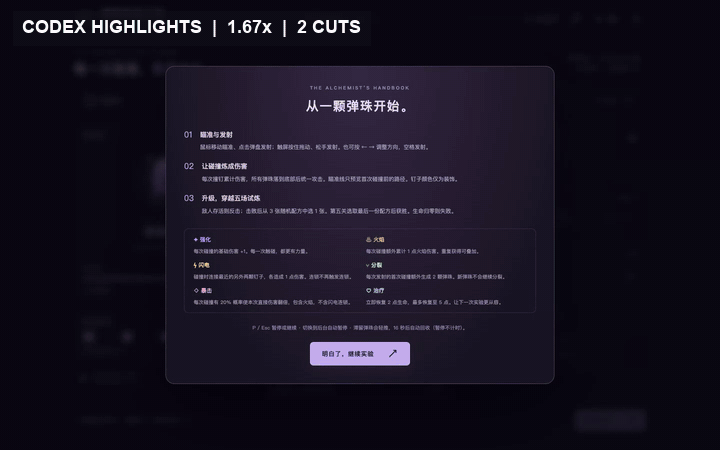

# 弹珠炼金工坊 · Marble Alchemy

[](https://github.com/convee/marble-alchemy/actions/workflows/ci.yml)
[](LICENSE)

> [在线试玩](https://convee.cn/marble-alchemy/) · [完整无剪辑录屏（v1.0.0）](https://github.com/convee/marble-alchemy/releases/download/v1.0.0/codex-gameplay-v1.0.0.mp4) · [测试与测评证据](evaluation/README.md)



一个完整的单人浏览器小游戏。TypeScript + Phaser 3.90 + Phaser 内置 Matter 物理，Vite 构建。游戏运行时的图形通过 Phaser Graphics、内联 SVG 和 CSS 绘制，音效通过 Web Audio 合成。无后端、无在线 AI、无外部图片请求、无字体 CDN、无付费素材。项目使用 MIT 许可，运行时依赖声明见 [`THIRD_PARTY_NOTICES.txt`](public/THIRD_PARTY_NOTICES.txt)。

<details>
<summary>English overview</summary>

**Marble Alchemy Workshop** is a five-stage neon pachinko roguelite. Aim a marble, bank damage through real Matter collisions, resolve the shot after every marble drains, then choose one of three upgrades. It runs entirely in the browser with procedural art and synthesized audio. No backend, online AI, external runtime image requests, font CDN, or paid material.

</details>

## 本地运行

需要 Node.js 22.12+（本次使用 22.22.3）及 npm。

```sh
cd marble-alchemy
npm ci
npm run dev
```

打开终端显示的地址，通常是 http://127.0.0.1:5173/ 。首次安装依赖需要联网；游戏运行时不请求外部服务。

```sh
npm run build       # 严格 TypeScript 检查 + 生产构建
npm run preview     # 本地预览 dist/，通常是 http://127.0.0.1:4173/
```

发布时将 `dist/` 作为站点根目录交给任意静态 HTTP 服务器。不应直接双击 `dist/index.html`，浏览器的 ES module 加载需要 HTTP。当前资源路径按站点根目录构建；部署到子目录时用 `npm run build -- --base=/你的子目录/`。

## 怎么玩

- 鼠标移动瞄准、点击弹盘发射；触屏按住拖动瞄准，松手发射。
- 也可用左右方向键调整，空格或“发射弹珠”按钮发射。瞄准线仅预览首次碰撞前的路径。
- 弹珠每次开始接触钉子时累计伤害。所有弹珠回收后等待 650ms，统一结算一次。
- 敌人仍存活，就扣除玩家生命；击败敌人，从三份随机且不同的配方中选择一份。
- 初始生命 5，上限 5。五关敌人生命分别为 **12 / 26 / 46 / 72 / 104**；前四关反击 1，最后一关反击 2。
- 每次击败敌人都获得一次升级，包括第五关；选完第五关的最终配方后展示胜利画面。生命归零展示失败画面，均可重新开始。
- `P` / `Esc` 暂停或继续；玩法说明也会暂停实验。后台切换会触发自动暂停，需要手动继续。
- 右上角音符开关控制音效，偏好保存在本地。无需账号，不保存进行中的一局。
- 不同颜色的钉子只有装饰区别。瞄准偏移会显著改变路径，可尝试让弹珠进入相邻钉子间的密集区域。

### 六种配方

| 配方 | 实际效果 | 重复规则 |
| --- | --- | --- |
| 强化 | 每次碰撞基础伤害 +1 | 可叠加 |
| 火焰 | 每次碰撞额外累计 1 点伤害 | 可叠加 |
| 闪电 | 连接距离最近的另外两个钉子，各累计 1 点伤害 | 获得后不再出现；连锁不再触发任何碰撞能力 |
| 分裂 | 每次发射的首次碰撞额外生成两颗真实 Matter 弹珠 | 获得后不再出现；整次发射仅分裂一次 |
| 暴击 | 每次碰撞独立以 20% 概率翻倍直接伤害 | 获得后不再出现 |
| 治疗 | 立即恢复 2 点生命，最多 5 点 | 可重复；满血也可能抽到，卡片显示实际恢复结果 |

直接伤害 = `(1 + 强化层数 + 火焰层数) × 暴击倍率`。闪电再独立加至多 2 点，不参与暴击，不递归。分裂弹珠继承已获得的伤害能力，但不会再生成分裂弹珠。

## 工程与边界处理

- `src/game.ts`：独立回合状态机、六种升级、五关配置、伤害计算与抽卡。
- `src/scene.ts`：Matter 刚体、碰撞事件、瞄准、拖尾、粒子、闪电和弹珠生命周期。
- `src/main.ts`：界面、原生 dialog 升级卡片、键鼠/触屏入口、暂停与重开。
- `src/audio.ts`：可关闭的程序合成音效，不支持音频或存储时仍可游玩。
- `src/style.css`：响应式霓虹工坊界面，无外部素材。

状态流为 `aiming → flying → settling → aiming / upgrade / lost`，升级后进入下一关或 `won`。

- 只有 `aiming` 可发射，`flying` 可计伤害，`settling` 可结算；结算立即转出原状态，拒绝重复调用。
- Matter `collisionstart` 计入一次真实接触。闪电直接累加数值，不创建碰撞事件。
- 分裂在物理事件后排队创建，避免修改正在遍历的物理世界；回收检测同时检查弹珠与分裂队列。
- 停滞约 850ms 的弹珠会被轻推；单颗弹珠存活超过 16 秒自动回收，已累计伤害保留。两项都按未暂停的实际时间计算，即使设备帧率较低也不会被拖长；越界和非有限坐标同样会回收。
- 速度限制为 13 个物理单位/步，降低高速穿透风险。碰撞体与可见钉子外圈一致。
- 暂停直接调用 Scene Systems 的同步暂停，冻结物理、活跃时钟、粒子和 650ms 结算等待。恢复不补算暂停时间。
- 重新开始取消待结算状态、移除所有弹珠、清空分裂队列、粒子、闪电、浮动文字、补间与配方，创建新的 Run；静态弹盘和输入监听只创建一次。
- 关闭弹窗即清空节点，旧卡片无法继续引用上一轮升级。
- 测试桥接仅在开发模式且显式指定 `VITE_TEST_MODE=true` 时暴露；普通开发页和生产页没有 `window.__alchemyTest`。

参考实现文档：[Phaser Matter](https://docs.phaser.io/phaser/concepts/physics/matter)、[Phaser Scenes](https://docs.phaser.io/phaser/concepts/scenes)。

## 测试

```sh
npm test              # 10 项纯规则测试
npm run test:e2e       # 启动独立的 5174 测试服务器，运行浏览器边界与 UI 测试
```

浏览器测试默认使用本机 Google Chrome。没有 Chrome 时：

```sh
npx playwright install chromium
PLAYWRIGHT_CHANNEL=chromium npm run test:e2e
```

不修改游戏状态的完整实玩脚本：

```sh
npm run dev
# 在另一个终端执行；默认使用 5173，也可用 GAME_URL 指向生产预览地址
npm run test:playthrough
# 例如 GAME_URL=http://127.0.0.1:4173/ npm run test:playthrough
```

它只通过界面发射与选择随机升级，记录每次伤害、生命和选卡，并保存截图；不会保证每次随机游玩都获胜。脚本通过不等于通关，需查看输出的 Result 与 `artifacts/natural-run.json`。

发布录屏同样只操作生产页面的正常界面；它要求工作树干净、最终结果为胜利，并把源码提交、构建、浏览器、请求响应和原始视频校验值写入清单：

```sh
npm run build
npm run preview
# 在另一个终端执行；TAKE 必须是尚不存在的安全目录名
TAKE=local-proof GAME_URL=http://127.0.0.1:4173/ npm run record
TAKE=local-proof npm run record:package
TAKE=local-proof npm run record:export
```

录屏默认使用本机 Google Chrome。可通过 `PLAYWRIGHT_CHANNEL=chromium` 改用 Playwright Chromium；派生视频需要 FFmpeg。最后一步会脱敏并导出公开测评 JSON，同时生成 MP4、原始 WebM、manifest 和 `SHA256SUMS` 四个 Release 文件。README GIF 是标明倍速与剪辑数的两个实录片段，Release MP4 保留完整时间线且不改变速度，原始 WebM 不做编辑。

详细的实测范围、辅助测试条件与未验证项目见 [TESTING.md](TESTING.md)。修复前的失败用例、修复后的机器可读结果、正常 UI 实玩清单和录屏校验值保存在 [evaluation/](evaluation/README.md)。构建包含 Phaser 完整运行时，会出现单个 JS 包超过 500kB 的体积提示；本次 gzip 约 345kB，构建正常成功。
